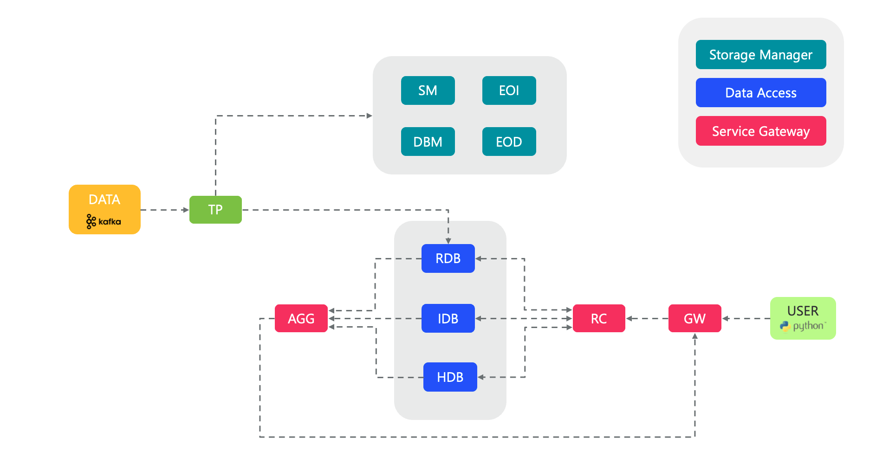

# kxi-microservices-data-services
- [kxi-microservices-data-services](#kxi-microservices-data-services)
  - [Architecture](#architecture)
  - [Quick Links](#quick-links)
  - [Prerequisites](#prerequisites)
  - [Get started](#get-started)

## Architecture

## Quick Links
* [Microservices](https://code.kx.com/insights/microservices)
  * [Storage Manager](https://code.kx.com/insights/microservices/storage-manager/introduction.html)
  * [Data Access](https://code.kx.com/insights/microservices/data-access/introduction.html)
  * [Service Gateway](https://code.kx.com/insights/microservices/data-access/introduction_sg.html)
  * [Stream Processor](https://code.kx.com/insights/microservices/stream-processor/index.html)

## Prerequisites
* Valid kdb license including feature flags
* Access to KX Docker repo ([nexus.dl.kx.com](https://nexus.dl.kx.com) / [registry.dl.kx.com](registry.dl.kx.com))
* [PyKX](https://code.kx.com/pykx) installed

## Get started
Choose you preferred orchestration:
* [Docker](docker)
* [Kubernetes](kubernetes)
